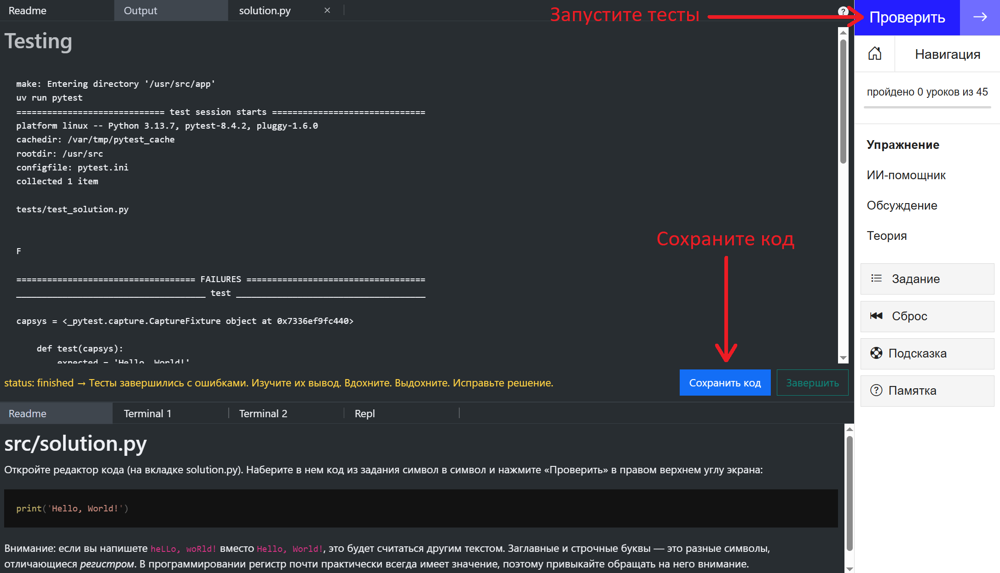
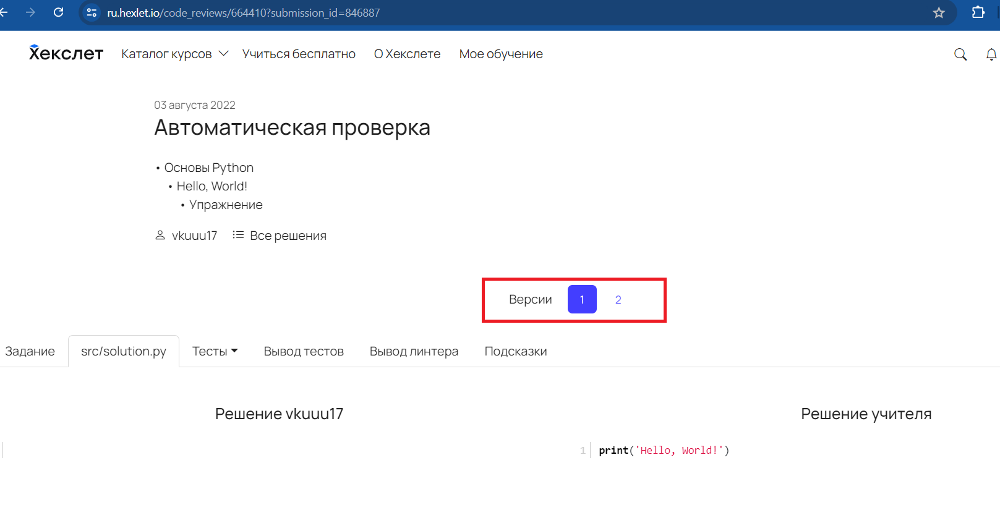
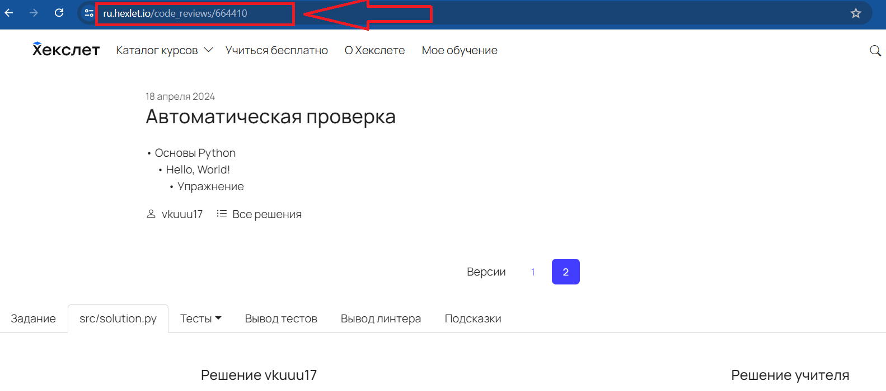
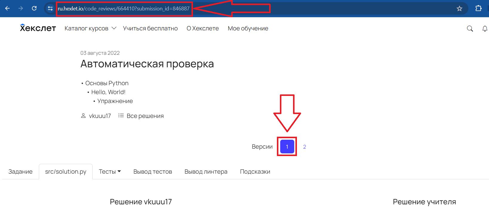
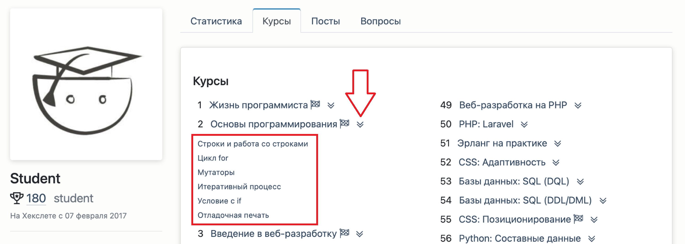
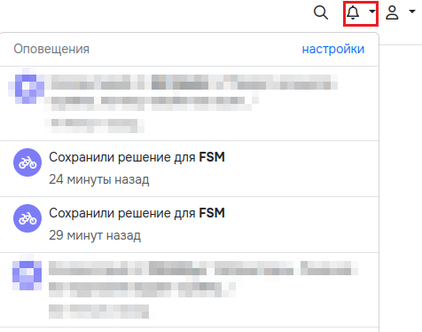

[Перейти на сайт](https://ru.hexlet.io)

# Как сохранить свое решение

Во время выполнения практики вы можете сохранять свои решения. Это не просто удобная, но и полезная функция. Сохранив решение, вы можете:

* приложить ссылку на него, когда задаете вопрос наставнику в учебном чате;
* проанализировать решение: сравнить свое с решением учителя и разобраться, как оно работает;
* зафиксировать версию решения, чтобы позже вернуться и попробовать решить задачу другим, возможно, более изящным способом.

## Как сохранить решение во время выполнения практики

* Запустите автоматические тесты
* На вкладке OUTPUT появятся результаты проверки
* Нажмите на кнопку «Сохранить код». Система сохранит решение, и кнопка изменится на «Посмотреть решение»

## Где искать сохраненное решения и как скопировать ссылку на него

Все ваши решения сохраняются в личном кабинете, в разделе «[Прогресс](https://ru.hexlet.io/my/learning)» → «[Мои решения](https://ru.hexlet.io/my/learning/code_reviews)».

На странице есть нескольких вкладок:

* условие задания
* решение студента и решение учителя, которое видно после успешного завершения упражнения
* тесты и их вывод

Сохраняйте несколько решений одного упражнения и переключайтесь между ними при помощи кнопок версий посередине страницы.

**Скопировать ссылку на ваше решение** можно прямо из строки браузера.

А если потребуется, то можно выбрать нужную версию вашего решения одного и того же упражнения и скопировать ссылку именно на него.

Также ссылки на сохраненные решения есть в профиле студента во вкладке «Курсы». Чтобы их увидеть, нажмите на стрелочку справа от названия курса.

А совсем недавние решения можно найти в разделе «Оповещения»:

