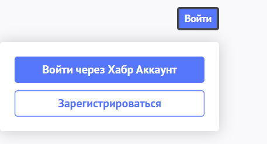
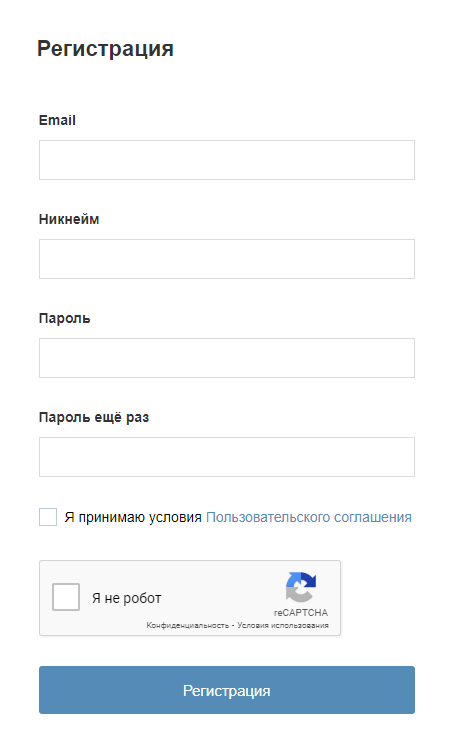
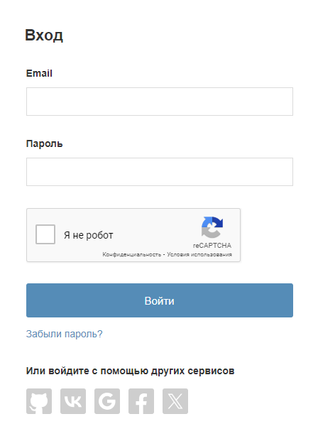
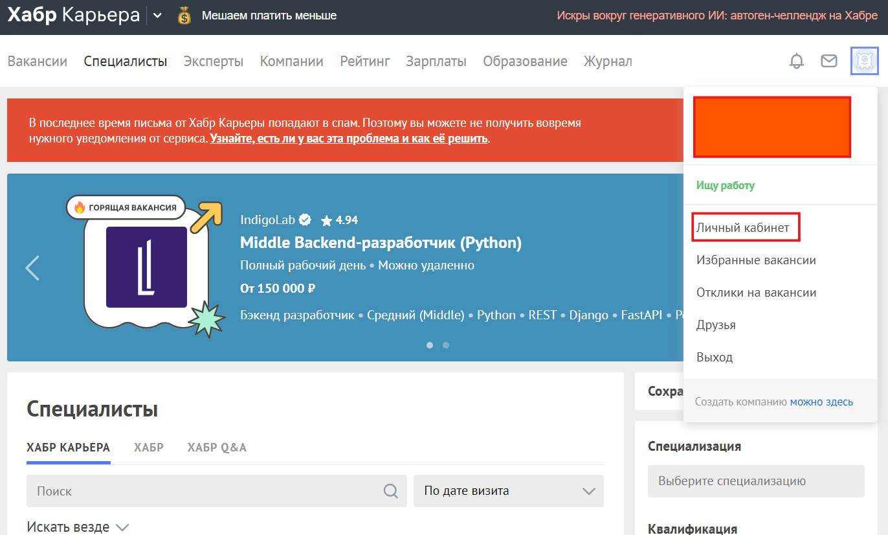
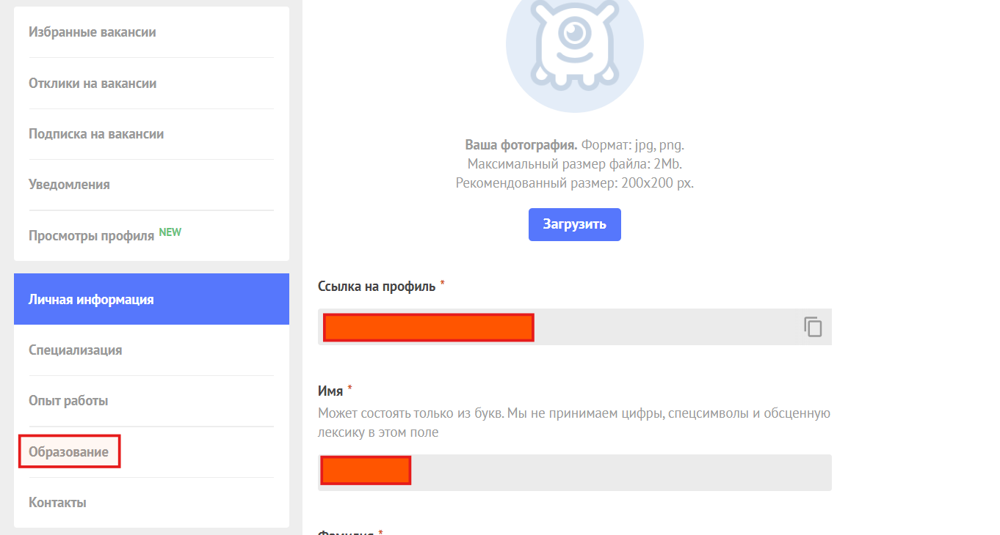
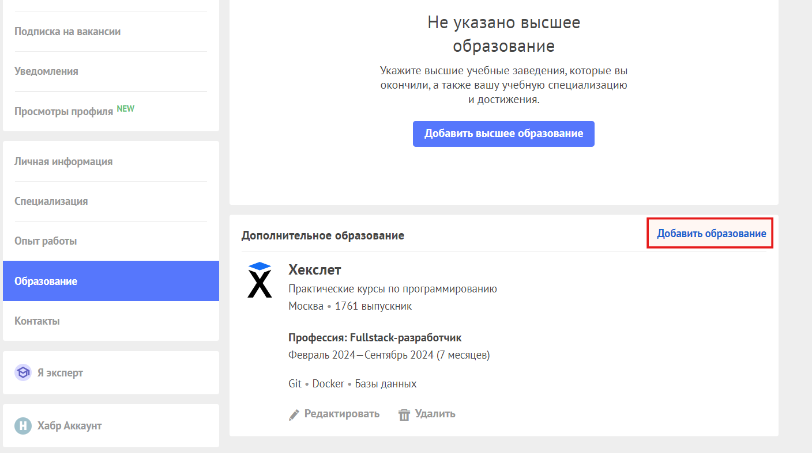
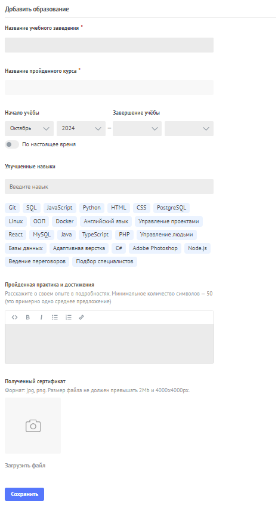

# Инструкция: как стать выпускником Хекслета на Хабр

1. Сначала вам необходимо зайти под своими логином и паролем на [Хабр.карьера](https://career.habr.com/) (если они у вас есть), либо зарегистрироваться, если аккаунта нет.
   

2. Переходим на сайт Хабр.карьера. Там кликаем по иконке личного кабинета в правом верхнем углу и выбираем пункт "Личный кабинет".

4. В личном кабинете листаем вниз и находим пункт "Образование". 

6. Перейдя в "Образование" (прямая ссылка: [тык](https://career.habr.com/profile/educations)), выбираем пункт "Добавить образование" 

7. Заполняем всю информацию о курсах, которые вы проходили. ВАЖНО: при наличии сертификата, прикрепите, пожалуйста, скриншот или фото сертификата. Это займет пару минут, но очень поможет Хекслету.

8. Нажимаем "Сохранить".

9. Готово! Вы великолепны!
