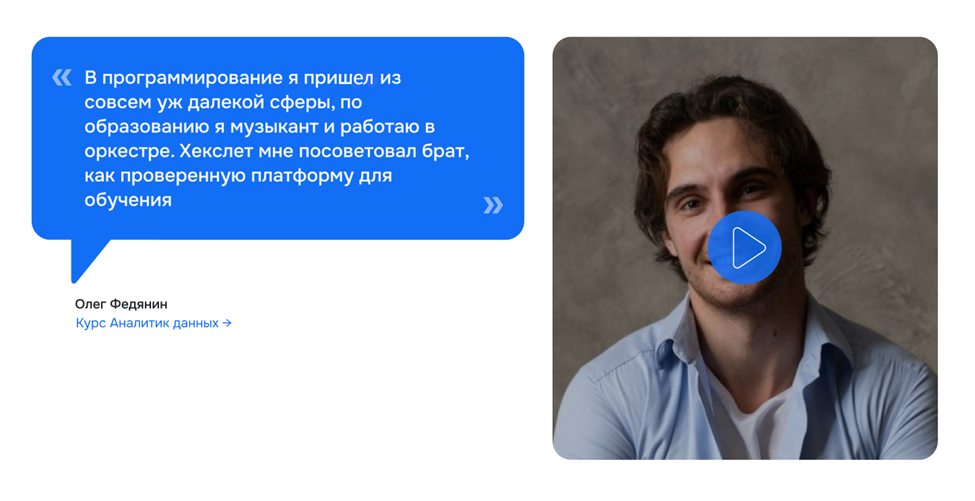

[Перейти на сайт](https://ru.hexlet.io)

# Как записать видеоотзыв

Привет!

Спасибо, что решили рассказать о нас ❤️

Примерно так будет выглядеть то, что мы затеяли, а сам видеоотзыв будет воспроизводиться в pop-up окне в вертикальном формате:

## Как быстро записать отзыв?

**Понадобится:**

- Телефон или ноутбук/пк с микрофоном
- Камера/вебкамера/камера телефона
- 5-10 минут вашего времени, в зависимости от тщательности подхода

### А что сказать?

Рассказать всё сразу очень сложно. Составьте примерный план, потренируйте рассказ или сделайте пару лишних дублей, чтобы ёмко донести мысль.

🙏🏻 Задача отзыва — поделиться своим опытом обучения. Представьте, что вы хотите рассказать об обучении у нас своему товарищу, который выбирает, где изучать программирование. Пусть это будет честно, чтобы слушатель понимал все за и против, мог принять взвешенное решение. В примерах ниже приведены пункты, которые можно использовать как опорные точки, но помните, история у каждого своя 😎

**Пример плана отзыва**

- Начать можно так: Привет! Меня зовут _______, в Хекслете я изучаю ______________.
- Чем занимались раньше и почему решили сменить сферу деятельности.
- Почему выбрали Хекслет.
- Как проходило обучение: что понравилось, а что можно улучшить.
- Если взаимодействовали с кем-то из команды Хекслета, можно отметить их работу. Например, рассказать о наставнике, кураторе, ребятах из Хекслет.Карьеры или поддержки.
- Если уже трудоустроились — где и как нашли работу, какая ваша текущая должность и задачи.
- Завершить отзыв можно парой добрых слов будущим студентам.

### Как записать?

- Выберите тихое место. Дома, на неоживлённой улице или в рабочем кабинете.
- Держите/поставьте телефон близко к лицу.
- Не “задувайте” в микрофон.
- Запишите видео любым удобным вам способом. Формат — “говорящая голова” как из любого блога или голосовое сообщение.

🙏🏻 Пожалуйста, не пишите звук на беспроводные наушники любой цены, бренда и форм-фактора. Используйте микрофон телефона, проводную гарнитуру или внешний микрофон/петличку.

**Формат и условия:**

- Не шумно и нет сильного эха.
- Вертикальная ориентация, как сторис или тик-ток (не “кружочек” из телеграма).
- Фон, который приятно показать и увидеть.
- Длительность 1-2,5 минуты, дольше — можно.

Убедитесь, что вас хорошо видно и слышно, нет пересветов или эффекта парящей в темноте головы. Посмотрите, что у вас получилось записать. Часто первый дубль — пристрелочный :)

Если же вы хотите оставить отзыв, который будет **больше 5 минут** — такой отзыв лучше всего сразу загружать на YouTube.

### Краткая инструкция по загрузке видео на YouTube:

**В приложении YouTube**

- Откройте приложение YouTube .
- Нажмите Создать, затем Загрузить видео.
- Выберите файл и нажмите ДАЛЕЕ.

Если вы закроете инструмент загрузки до того, как выполните все нужные действия, ваше видео сохранится на странице Контент в виде черновика.

**В приложении "Творческая студия YouTube"**

Примечание: самостоятельно сертифицировать видео в приложении "Творческая студия YouTube" нельзя.

- Откройте приложение "Творческая студия YouTube" .
- Нажмите Создать, затем Загрузить видео.
- Выберите нужный файл.
- Укажите название видео (не более 100 символов), выберите тип доступа и задайте настройки монетизации.
- Нажмите Далее.
- Укажите аудиторию, выбрав "Видео для детей" или "Видео не для детей".
- Нажмите Загрузить. 

📌 И не забывайте ставить хештеги #хекслет #hexlet - это очень сильно помогает при поиске отзывов про нас от других учеников:)

## Как отправить нам исходные файлы:

Прикрепить файлом или залить на любое облако и отправить ссылку с открытыми доступами для скачивания на support@hexlet.io. Также будем признательны, если укажешь следующую информацию вместе с отзывом (а также проговоришь эту информацию в видеоотзыве, опционально):

1. Имя/Фамилия.
2. Предыдущее место работы и должность (или текущее, если курсы еще не завершил).
3. Текущее место работы (если завершил курсы).
4. Возраст.
5. Ссылка на любую соц.сеть, если готовы, чтобы к вам приходили с вопросами об обучении. 

Готово!

Вы очень помогли нам и всем, кто выбирает будущую профессию 💕

